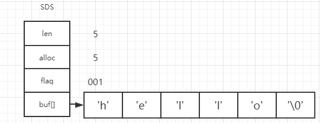

### 分布式缓存技术的应用

传统应用：直接访问数据库

随着访问量上升，响应时间要求越来越高，数据量越来越多，解决方式：升级为 SSD 等，单纯从数据库层面优化无法解决这个问题。

数据放入内存，则数据读取性能提升，但是所有数据进入内存是不现实的，数据访问存在二八理论，所以需要我们引入一些组件来缓存这部分热点数据。

多级缓存：内存缓存组件 本地缓存组件 分布式缓存组件等等

### Redis 的魅力

基于 key value 的高性能存储系统，数据结构丰富，可以划分多个 DB，默认有 16 个 DB 空间，可以选择存入的具体 DB 空间，基于内存，支持持久化（AOF RDB），支持发布订阅模式等等。

指令：redisdoc.com/index.html

### Redis 的数据类型及常用命令

#### 字符串

Redis 并没有采用 C 语言的字符串来表示 string 数据类型，而是自己构建了一种可以称作是 【简单动态字符串】 的抽象类型，英文表示为 simple dynamic string , 简称为 SDS 。

SDS 根据所要存储字符串长度的不同也分为好几种类型，根据 Redis 源码可以看到 SDS 有如下类型：


如上图代码所示，SDS 分为 sdshdr5 / sdshdr8 / sdshdr16 / sdshdr32 / sdshdr64 五种类型，举个栗子，比如说 sdshdr8 代表可以存储 2^8 - 1 = 255 个长度的字符串，sdshdr8 也是 Redis 默认的字符串存储类型。

##### 字符串类型应用场景概述

1. 存储 session信息从而达到共享 session 的目的 ；

2. 存储一些用户基本信息等数据；

3. 当做计数器，实现 IP 限制等功能

   如果 value 是整型的话，使用 INCR 指令进行原子自增操作，当做计数器来使用，其中自增范围是 signed long 的最大和最小值之间，比如一分钟内可以请求几次短信验证码等功能；

其实字符串可以说是我们经常用的一种数据结构，很多时候我们都是把数据直接转换成 JSON 格式字符串存入到 Redis 中，然后直接解析 JSON 字符串就可以得到我们所需要特定格式的数据。

##### 字符串的底层实现数据结构

Redis 对于字符串类型在底层所采用的数据结构部有两种：int 或者 SDS。

* 当 value 值是整型的时候，会采用 int 结构来存储；
* 反之，不是 整型的情况一律采用 SDS 结构来存储；

如上图源码可得，我们以 sdshdr8 为例：

```C
struct __attribute__ ((__packed__)) sdshdr8 {
    uint8_t len; /* used */
    uint8_t alloc; /* excluding the header and null terminator */
    unsigned char flags; /* 3 lsb of type, 5 unused bits */
    char buf[];
};
```

其中：

1. len 属性代表了当前 sds 的实际长度；
2. alloc 属性代表了已经为 sds 分配的内存空间；
3. flags 属性代表了 sds 字符串类型；
4. buf[] 属性代表了 sds 字符串的位置;

###### 内存布局

比如创建字符串 'hello',此时在 Redis 中的存储结构如下：



INCR 对整数可以原子递增 当做计数器（如果先 get num num++ set num 这样就是复合操作了）

此时 len = 5,alloc = 5, buf[] 存储的是实际字符串的内容，此处要注意的是 len 和 alloc 在计算的时候，不会把字符串末尾的空字符计算进去，这个空字符仅仅是为了标识字符串结束，和 C 语言中的字符串做兼容。

有人可能会想到，如果采用了 sdshdr8 类型来存储字符串的话，它所能存储的最大长度为 255，一旦字符串长度超过这个长度了，Redis 会怎么办呢？

实际上 Redis 会自动扩容，而且它的扩容一般遵循以下原则：

- 当字符串长度不足 1MB，扩容的时候每次扩容一倍；
- 当字符串长度超过 1MB，扩容的时候每次直接扩容 1MB；

#### 列表

quicklist / ziplist

使用了链表结构，双向链表，无环，获取两端元素速度特别快，但是按照索引查找其他数据会很慢。

在 Redis 中的存储结构：

redis 3.2 之前 linkedlist 和 ziplist

redis 3.2 之后 **quicklist** (结合了 linkedlist 和 ziplist 的特性) ，基于 ziplist 的双向链表

源码文件：

​	quicklist.c

​	quicklist.h

​	typedr struct quicklist {

​		tail;

​		head;

​		count;

​		len;

​	}quicklist ;


quickListNode {

​	prev;

​	next;

​	zl;// ziplist

}

##### 应用场景

实现栈 lpush lpop

实现队列 lpush rpop

实现消息队列 lpush brpop

#### 哈希

(key, filed value) 格式的数据，字典结构。

##### 底层存储结构

hashtable / ziplist(数据量小的时候)

源码：dict.h

dictEntry:管理 key 和 value

dictType:

dictht:

dict: 核心，reahsh 需要用到

#### 集合

##### 数据结构

intset(全是整数的时候) / hashtable(key,value(所以把 value 设置为了 null))

##### 使用场景

去重；标签等

#### 有序集合

zset 的实现：

ziplist / skiplist - hashtable

首先是一个有序的链表

先使用算法算出层数，然后比较大小；将数据放入到具体的层中；

跳跃表时间复杂度 O（logN）数据增加 256 倍，时间只会增加 8 倍

##### 应用场景

根据点击了排序热门文章

根据时间去排序热点新闻等等；

### 过期时间设置及原理分析

##### 过期时间设置

* expire key seconds

* setex(String key,int seconds,String value)

keys 查看当前有哪些 key 值

ttl key 监控过期时间的变化,当 key 不存在的时候会返回 -2

##### 原理

expire 的原理

redis.io 查看 expire 的介绍, 可以得出以下两种删除方式：

* 消极方法：应用访问 key 时发现 key 失效了，则把它删除；
* 积极方法：周期性的从设置了过期时间的 key 中随机选择一部分 key 进行删除；
  1. 首先随机测试 20 个带有 timeout 信息的 key，如果发现过期了，则直接删除;
  2. 如果有超过 25% 的 key 被删除，则重复执行整个流程；

### 发布 / 订阅

##### 消息发送和接受的过程

 producer - channel -  consumer

##### 相关指令

publish channel.name hello 发布

subscribe channel.name 订阅

##### 应用场景

和消息中间件的差距在于不同协议 可以回滚 可以持久化等等 Redis 是不具备的，但是我们可以用它来实现站内实时聊天等功能，消息丢失影响也不大。

### 持久化及原理分析

缓存雪崩 缓存击穿

##### RDB （全量）

当符合【条件】的时候，redis  fork 一个子进程，把 Redis 中的数据写到一个临时文件 dump.rdb 中，如果之前已经存在这个临时文件的话，会直接覆盖这个文件，由于是 子进程在操作，从而不会影响主进程。

需要满足的条件有：

1. 配置文件中规则配置：save seconds changes

   save 900 1 : 一秒之内有 900 个 key 发生变化，则触发快照

2. 执行指令 save（会阻塞所有客户端的请求）或者 bgsave（不会阻塞客户端请求） 由用户主动发起快照请求；

3. 执行指令 flushall 清除所有的内存数据，只要我们配置的 save 规则存在，就会开始快照操作；

4. 执行复制操作 master slave 主从复制操作；

###### 缺点

数据会丢失，如果正好是在两次快照间隔期间发生错误的话；

子进程比较耗费性能；

默认使用 RDB 方式；默认使用消极删除方式；

###### 优点

##### AOF（增量）

appendonly.aof

默认是关闭的；可以在配置文件中配置属性 **appenonly yes** ； 

每次数据更新的时候会把数据同步写入到 aof 文件一份；

比较耗费性能，因为每次需要写两遍；

但是丢失的数据会很少；

// TODO

aof 文件载入较慢；整个载入过程中 Redis 值无法提供服务的；

当文件过大时，我们可以配置属性来压缩重写 aof 文件：

* auto-aof-rewrite-percentage 100 : 当目前 aof 文件超过上一次重写的 100% 大小之后开始从写改文件

* auto-aof-rewrite-min-size 64MB： : 当目前 aof 文件小于 64 MB 的时候没有必要重写

// TODO

重写过程时会 fork 子进程来完成，直接将当前内存中的文件重写一遍，生成一个临时文件，临时文件重写完成之后，用这个临时文件覆盖之前的 aof 文件；

当这个子进程异步生成的 aof 文件和当前内存数据不一致的时候，在这个过程中产生的数据会写到重写缓存中，在 aof 文件写入结束之后，将重写缓存中的数据追加到 aof 文件中。

###### 操作系统层面缓存同步到磁盘的时间周期

* appendfsync always : 每一次操作都同步一次；

* appendfsync everysec：每一秒钟同步一次，默认；

* appendfsync no：由操作系统完成，不主动触发；

##### 可以结合以上两种方式来完成持久化

RDB 文件恢复速度快，AOF 文件比较全，各有优势，根据自己情况选择。对数据安全性和实时性要求高的话可以两种结合来用。

### Redis 的内存回收策略

Redis 基于内存，随着业务增长，数据越来越多，有可能会撑爆服务器内存，从而为了保证机器内存可用，我们需要有一定的回收策略。

###### 回收策略

redis.config 文件中配置 maxmemory-policy 属性

* noeviction：默认配置项 当占用内存超过一定阈值的时候继续申请内存会报错；

* allkeys-lru: 最少使用的数据淘汰；

* allkeys-ramdom: 随机淘汰某些 key；

* voliatile-random / lru / ttl : 已经设置了过期时间的 随机淘汰 / 最少使用的淘汰 / 即将过期的淘汰；

**注意**：不是严格的 LRU 算法，一般是采取随机抽样；

### Redis 单线程为什么性能很高?

Redis 的主要瓶颈在内存和网络，而不再 CPU 的利用效率上，从而没有必要使用多线程机制，同时单线程也减少了频繁的线程切换消耗；

// TODO file event handler 文件事件处理器

* IO 多路复用机制(Netty 中学习)；

* 纯内存操作，效率很高；
* 单线程可以避免多线程的上下文切换(弊端在于只能利用一个 CPU 核心)；

###### 引入四个概念

同步/异步：用户线程和内核线程的交互方式

阻塞/非阻塞：

* 同步阻塞：BIO
* 同步非阻塞：客户端会轮询，会浪费一些 CPU 资源
* 异步阻塞：也叫 IO 多路复用
* 异步非阻塞：

### Lua 脚本的使用

// TODO

**注意**：关于 IO 多路复用，回顾 TCP 课程。

2019-07-09

---------------------------

分布式 Redis 

2017-07-11

-------------

### Redis 的集群

主要是用来解决单点问题

采用主从复制方案（master-slave）

##### 搭建主从结构

redis.conf

slaveof 192.168.11.153 6379


./redis-cli

info replication


bind 127.0.0.1 只能本机访问


##### 主从复制原理

* 全量复制

  一般在初始化的时候，需要把 master 节点的数据复制到初始化的 slave 上

  replconf listening-port 6379

  sync

  配置项 redis.conf 

  min-slave-to-write 3  主节点至少同步多少个子节点(至少3 个子节点才允许写数据)

  min-slave-maxl-lag 10 允许网络丢失多长时间 超过 10 秒没有回应认为是断开了

* 增量复制

  info replication 可以看到两个文件：

  backlog：

  offset：表示当前数据同步到的位置

* 无磁盘复制

  repl-diskless-sync no 不生成磁盘快照，在内存直接生成 RDB 文件进行同步

##### 选主

选主使用的是哨兵机制

### 哨兵机制

master 选举

1. 监控 master 和 slave 是否正常运行;
2. 当 master 出现故障的时候，从 slave 中选举一个新的 master;

sentinel ；raft 算法；

### Redis-Clluster

数据分片 

### Redis 的实践应用

