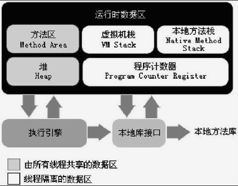
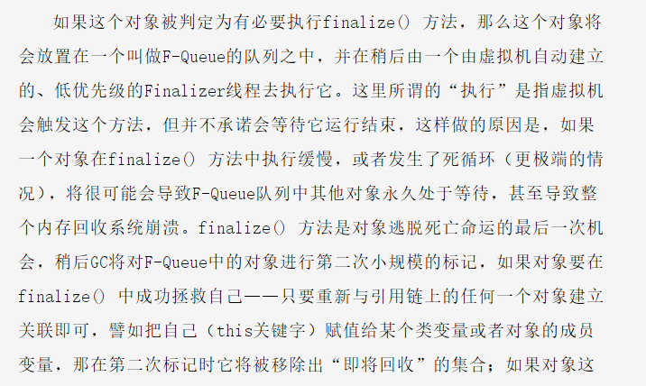
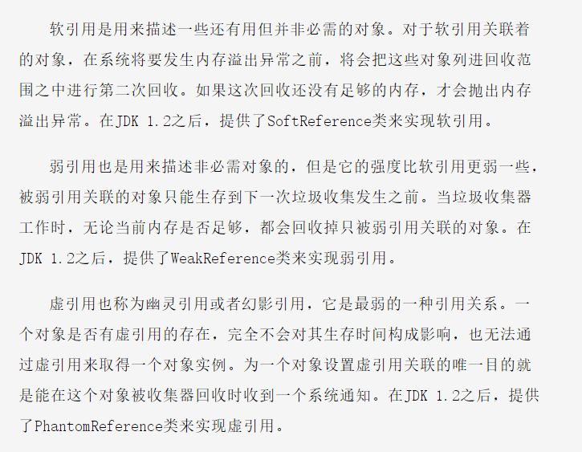

# 深入理解 Java 虚拟机读书笔记

## 第二章  Java 内存区域与内存溢出异常

### 运行时数据区

#### 程序计数器

当前线程所执行的字节码的 **行号指示器**

每条线程都需要有一个独立的 程序计数器，各条线程之间计数器互不影响，属于**线程私有区域**

* 如果执行的是一个 Java 方法，计数器记录的是正在执行的虚拟机字节码指令的地址

* 如果执行的是一个 Native 方法，计数器的值则为空（undefined）

#### Java 虚拟机栈

也是属于**线程私有区域**，生命周期与线程相同。

每个 Java 方法在执行的同时都会创建一个栈帧用于存储局部变量、操作数栈、方法出口等信息，每一个方法从调用直至执行完成的过程，就对应着一个栈帧在虚拟机栈中入栈到出栈的过程。

局部变量表所需的内存空间在编译期间完成分配，当进入一个方法时，这个方法需要在帧中分配多大的局部变量空间是完全确定的，在方法运行期间不会改变局部变量表的大小。

该区域有两种异常情况

* `StackOverflowError` ：线程请求的栈深度大于虚拟机所允许的深度 
* `OutOfMemoryError` ：虚拟机在自动扩展的时候请求不到足够的内存

#### 本地方法栈

与虚拟机栈发挥的作用类似，但是两者服务对象不同，本地方法栈为虚拟机使用到的 Native 方法服务，虚拟机栈为虚拟机执行的 Java 方法服务。

备注：有的虚拟机实现可以把二者合二为一

与虚拟机栈一样，该区域也存在两种异常情况，同上。

#### Java 堆

Heap 是 虚拟机所管理内存中最大的一块，此区域是被所有线程共享的一块内存区域，在虚拟机启动时创建。

此区域的唯一目的就是 **存放对象实例**，几乎所有的对象都在这里分配内存。

#### 方法区

此区域是线程共享的，用于存储已被虚拟机加载的类信息、常量、静态变量等代码数据。

当方法区无法满足内存分配需求时，抛出 `OutOfMemoryError`异常。

##### 运行时常量池

方法区的一部分

### HotSpot 虚拟机对象探秘

#### 对象的创建

* 指针碰撞

* 空闲列表

#### 对象的内存布局

对象在内存中存储的布局可以分为 3 块区域：**对象头、实例数据和对齐填充**

## 第三章 垃圾收集器与内存分配策略

### 概述

说起垃圾回收我们需要思考三个问题：

* 哪些内存需要回收 ？
* 什么时候回收 ？
* 怎么回收 ？

如何判断对象是否存活？

#### 引用计数算法

为每个对象设置一个引用计数器，每当有一个地方引用该对象时，计数器值加 1 ，引用失效时，计数器值减 1，当计数器值变成 0 的时候就代表这个对象是不可能再被使用的，此时就代表该对象可以回收。

这种算法实现简单，效率也很高，但是同时也会存在一个问题，那就是当两个对象相互循环引用的时候，哪怕这两个对象以后再也不会用到，但是因为相互引用的问题，这两个对象的引用计数器始终不为 0，导致 GC 无法回收他们。

也正是因为这个问题，所以很多主流虚拟机厂商都没有选择这种回收计数算法。而更多的使用的是下文将要介绍的**可达性分析算法**。

#### 可达性分析算法

该算法的原理是：以 `GC Roots` 的对象作为起始点，然后以该节点为基准开始向下搜索，搜索过程中搜索路径我们称之为**引用链**，当一个对象到 `GC Roots` 没有任何引用链连接的时候，说明该对象是不可用的。

注意：可以作为 `GC Roots` 对象的包括以下几种

* 虚拟机栈（本地变量表）中引用的对象
* 方法区中类静态属性引用的对象
* 方法区中常量引用的对象
* 本地方法栈中 JNI （Native 方法）引用的对象

我们需要注意一点，哪就是即使通过可达性分析中不可达的对象也不是必须要回收的。

一个对象在真正被回收之前，需要经历两次标记过程：

>如果对象在进行可达性分析之后发现没有与 GC Roots 相连接的引用链，那它将会被第一次标记并且进行一次筛选，筛选的条件是此对象是否有必要执行 finalize() 方法，当对象没有覆盖 finalize() 方法 或者 finalize() 方法已经被虚拟机调用过，这两种情况下虚拟机都认为此时没有必要执行垃圾回收。
>
>
>
>个时候还没有逃脱，哪基本上它就真的被回收了。

##### 四种引用方式

根据引用强度（从上至下依次减弱）可依次划分为：

* 强引用 `Strong Reference`

* 软引用 `Weak Reference`

* 弱引用 `Phantom Reference`

* 虚引用 `Soft Reference`

### 垃圾收集算法

#### 标记-清楚算法

**缺点**：

* 效率问题：标记和清楚这两个过程效率都不太高
* 空间问题：标记清楚之后会产生大量不连续的内存碎片

#### 复制算法

为了解决效率问题，复制算法出现了，它将可用内存分成了大小相等的两块，每次只使用其中的一块，当其中一块的内存用完了之后就将这个区域还存活的对象全部复制到另一块内存上去，然后把直接把这块内存区域全部回收掉。

这种分配方式也不用考虑内存碎片等复杂情况，只需要移动堆顶指针，按顺序分配内存就可以，实现简单，运行高效。

**缺点**：浪费了足足一半的内存区域，内存利用率只有 50%，代价太高昂。

哪么怎么样改善这种情况呢？

哪就是在划分内存空间的时候并不是按照 1:1 来划分，而是按照 Eden区域 ：S0 区域 ： S1 区域 为 8：1：1 的比例，每次在进行复制的时候都是选择把 Eden 区域和 S0 区域的存活对象复制到 S1 区域，这样一来整个内存空间的利用率就会达到 90%。

注意：在上述条件下，一旦 S1 区域空间不足，将会依赖老年代进行分配担保，就是说会把部分对象放到老年代。

#### 标记-整理算法

复制算法如果在对象存活率较高的时候就需要进行很多的复制操作，效率将会更低，除此之外，还需要有老年代的分配担保，因此对于老年代的回收一般都不会选择这种算法。

老年代主要是长期存活的对象或者比较大的对象，针对这种情况，又提出了标记-整理算法，标记过程和上述的标记-清楚类似，但是之后的步骤中，并不是直接对可回收对象进行回收，而是让所有存活对象都向一边移动，然后直接清理掉端边界以外的内存。

#### 分代收集算法

因为每个对象的生命周期不一致，所以经常把 Java 堆分为新生代和老年代，所以就提出了一种分代收集算法。

新生代中，每次垃圾回收时都有很多对象死去，只要少数存活，此时可以选择**复制算法**；

老年代中，对象一般都是存活率高、没有额外空间对它进行分配担保，则选择**标记-清理**或者**标记-整理**算法。

### 垃圾收集器

#### Serial 收集器

单线程收集器 进行垃圾收集时，其他的工作线程必须停止等待他进行垃圾回收。

* 运行在 Client 模式下的虚拟机首选的垃圾收集器

**优点**

简单高效

#### ParNew 收集器

是 Serial 收集器的多线程版本

* 运行在 Server 模式下的虚拟机中首选的新生代收集器。